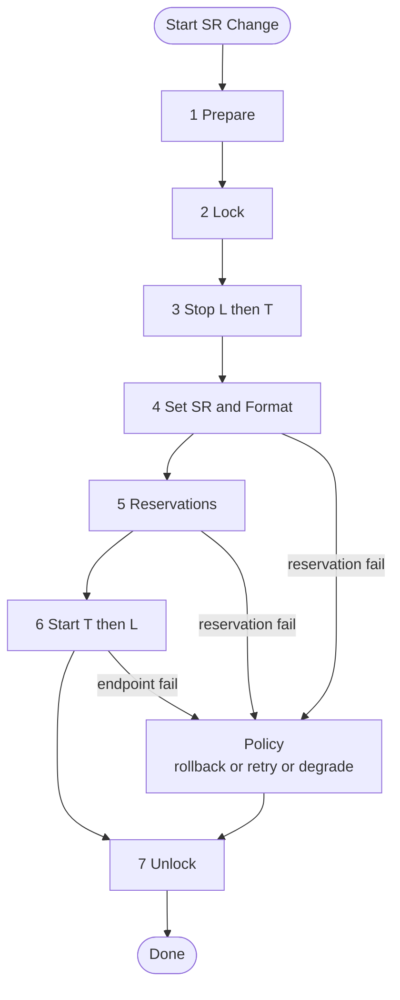

# MILAN Sampling Rate Change Controller

## Overview

This repository defines a **Sampling Rate Change Controller** state machine intended for MILAN / AVB environments.  
Its purpose is to formalize the order of operations required to coordinate a **sampling rate change** across multiple connected entities (Talkers and Listeners) while ensuring deterministic synchronization, proper reservation handling, and predictable system recovery from errors.

This controller encapsulates the procedure that was commonly implemented before MILAN standardization, providing a reproducible and interoperable orchestration sequence.

---

## Motivation

> “It would be nice if Milan could define a state machine for executing a sampling rate change among multiple connected entities. This should specify the order of operations and what will be done in the case of various capability flags such as sample rate conversion.  
> Prior to Milan, we accomplished the first scenario by having our controller lock the selected entities, issue a stop streaming command to all the listeners and talkers, issue a set sampling rate command, issue set stream format commands, issue start streaming commands, and then unlocking the entities. We would release the MSRP reservation when the stream’s sampling rate was changed and make the new reservation as soon as possible after the talker’s start streaming command.”

This controller implements that same logic as a **formalized state machine**, suitable for automation, conformance testing, or integration into Milan-compliant controllers.

---

## Architecture Summary

### Entities

-   **Talkers (T)** — audio sources initiating AVB streams
-   **Listeners (L)** — audio sinks subscribing to Talker streams
-   **Controller (C)** — orchestrates synchronized transitions across Talkers and Listeners

### Key Operations

1. **LOCK_ALL** — prevent configuration changes during the transition
2. **STOP streaming** — stop Listeners first, then Talkers
3. **SET_SR** — apply new sampling rate to all entities
4. **MSRP_RELEASE** — release existing stream reservations after the rate change
5. **SET_FMT** — update stream format to match the new sampling rate
6. **START_TALKERS** — restart streams from Talkers
7. **MSRP_RESERVE** — establish new reservations based on updated timing
8. **START_LISTENERS** — reattach Listeners to running Talkers
9. **UNLOCK_ALL** — release configuration locks

---

## State Machine Description

The **controller** follows these global coordination phases:

| Phase | Action                                                                 |
| ----- | ---------------------------------------------------------------------- |
| 1     | **Prepare**: discover affected entities and capabilities               |
| 2     | **Lock**: issue lock commands to all entities                          |
| 3     | **Stop**: stop listeners, then talkers                                 |
| 4     | **Reconfigure**: set new sampling rate and stream format               |
| 5     | **Reservation Management**: release and re-establish MSRP reservations |
| 6     | **Restart**: start talkers, then listeners                             |
| 7     | **Unlock**: finalize and restore normal operation                      |

Error handling (timeouts, negative acks, or reservation failures) is handled through rollback, retry, or degrade strategies depending on policy.

---

## Diagram

The diagram below (in [Mermaid](https://mermaid.js.org/)) shows the **controller orchestration state machine**.

